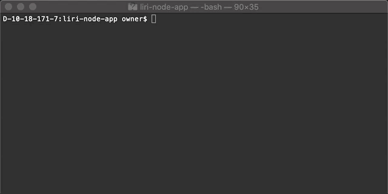
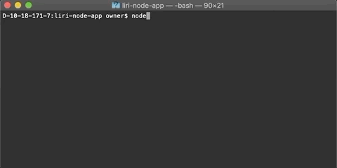
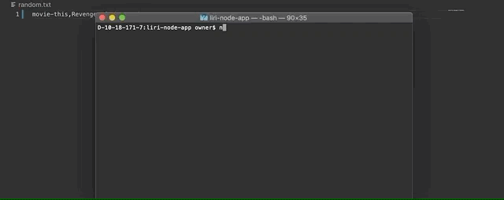

# liri-node-app

Overview: 

    Create an Node App that can recognize a simple set of commands, call out to another server using API/Axios NPM for information, and present it back to the user in the Terminal/bash window as a useful set of data.

Basic Functions/Parameters:

    --Spotify this Song:
        Command line prompt: node liri.js spotify-this-song <name of song>

        Will return spotify information for song entered in command line, including:
            Artist:
            Song:
            Spotify direct URL:
            Album:

         

    --Concert this Artist:
        Command line prompt: node liri.js concert-this <name of artist>

        Will return next listed concert for artist entered in command line, including:
            Artist:
            Description of event:
            Venue Name:
            Location:
            Date:

    --Movie info:
        Command line prompt: node liri.js movie-this <name of movie>

        Will return Open Movie Database information for movie entered in command line, including:
            Title:
            Year:
            Rating:
            Country of Release:
            Plot Summary:
            Actors:
            Rotten Tomatoes rating:

    --Take command from TXT file:
        From a text file located in the root directory, the app takes in a command(from above) and a title/artist, separated by a comma. Uses command to run same operations as above.

